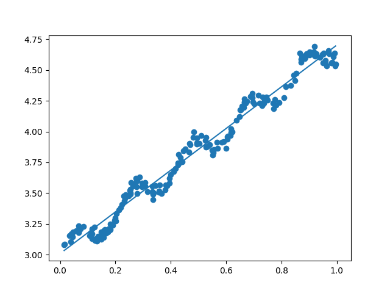
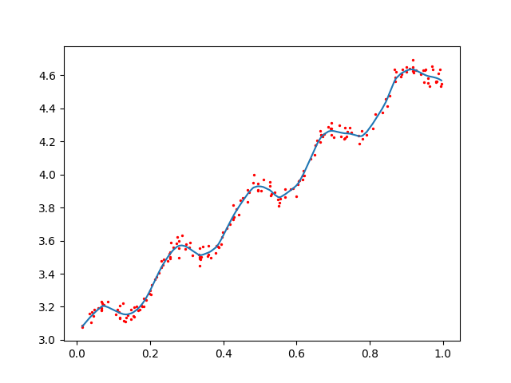
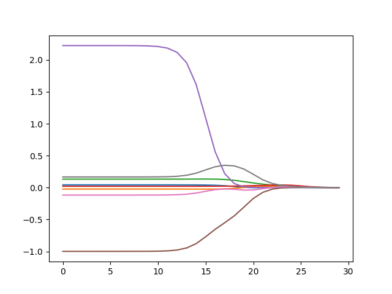

## This is 8th chapter of Machine Learning in Action

### And below are some figures in this chapter.

8.1 Basic linear regression

8.2 Locally weighted linear regression

8.4 Coefficient values versus iteration

